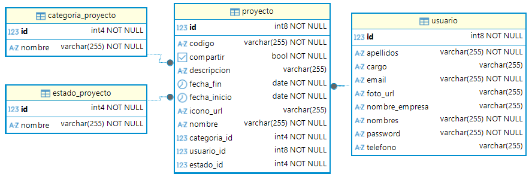

# Prueba Técnica - Backend

Se ha desarrollado una API REST con el propósito de dar soporte a una aplicación móvil de gestión de proyectos, permitiendo la gestión de usuarios, autenticación segura y el control total de tableros de proyectos con búsqueda avanzada.

## 🚀 Tecnologías y Herramientas

* **Java 25**: Uso de funciones modernas como ```records``` para DTOs.
* **Spring Boot 4.1.0-M4**: Framework ágil para la creación de microservicios.
* **Spring Data JPA**: Abstracción de persistencia para PostgreSQL.
* **PostgreSQL**: Motor de base de datos relacional para entornos de producción.
* **BCrypt**: Hashing de alta seguridad para la protección de credenciales.
* **Lombok**: Optimización de código mediante anotaciones.
* **Maven**: Gestión de ciclo de vida y dependencias.

## 📊 Modelo de Base de Datos
El sistema se basa en un modelo relacional normalizado en Tercera Forma Normal (3FN):

* **Usuario**: Gestión de perfiles y credenciales seguras.
* **Proyecto**: Entidad central de negocio vinculada a un creador.
* **EstadoProyecto**: Tabla maestra para estandarizar los estados (PLANIFICACIÓN, EN CURSO, etc.).
* **CategoriaProyecto**: Tabla maestra para la clasificación de tableros (Desarrollo, Diseño, etc.).



La estructura fue diseñada bajo cuatro pilares fundamentales de ingeniería de software:

* **Normalización y Consistencia:** Se migraron los atributos de "Estado" y "Categoría" de simples cadenas de texto (String) a Tablas Maestras (estado_proyecto, categoria_proyecto). Esto permite que el sistema solo procese estados válidos y definidos, evitando errores de duplicidad o inconsistencia en los filtros de búsqueda.

* **Integridad Referencial:** Se implementaron Llaves Foráneas (FK) con restricciones NOT NULL. Esto asegura que no existan proyectos "huérfanos"; cada tablero debe pertenecer obligatoriamente a un usuario creador, a un estado y a una categoría.

* **Escalabilidad:** El uso de tablas maestras permite que el sistema crezca sin modificar el código fuente. Si se requiere crear una nueva categoría (ej. "Diseño UX"), basta con realizar un INSERT en la base de datos, y el backend la reconocerá automáticamente para el filtrado.

* **Seguridad y Auditoría:** La relación 1:N entre Usuario y Proyecto permite implementar un control de acceso granular. En los endpoints de búsqueda y listado, se filtra estrictamente por el usuario_id, asegurando que cada uno solo acceda y gestione sus propios tableros.


## 🛣️ Guía de Endpoints

### Usuarios
* `POST /api/usuarios/registro`: Registra un nuevo usuario con contraseña encriptada.
* `POST /api/usuarios/login`: Valida credenciales y retorna los datos del usuario.
* `PUT /api/usuarios/{id}`: Actualiza la información del perfil y foto.

### Proyectos
* `GET /api/proyectos/usuario/{id}`: Lista los proyectos específicos de un usuario (Home).
* `GET /api/proyectos/search`: Búsqueda avanzada con filtros opcionales (código, nombre, estado, fechas).
* `GET /api/proyectos/home-search`: Buscador rápido por nombre para la pantalla principal.
* `POST /api/proyectos`: Crea un nuevo proyecto vinculado al usuario logueado.


## 🛠️ Configuración Local

**1.Clonar el repositorio:**

```bash
git clone https://github.com/Ariess202/PruebaTecnica.git
```

**2.Base de Datos:** 
Crea una base de datos en PostgreSQL y restaura el dump incluido para tener los datos de prueba y tablas maestras:

```bash
psql -U tu_usuario -d tu_db -f database/backup_db.sql
```

**3.Propiedades:** Configura tus credenciales en ``src/main/resources/application.properties``.

**4.Ejecución**
```bash
./mvnw spring-boot:run
```

## ✨ Puntos Destacados

* **Seguridad & Privacidad**: Hashing de contraseñas con **BCrypt** y uso de `JsonProperty.Access.WRITE_ONLY` para evitar la exposición de credenciales en las respuestas JSON.
* **Validación Robusta**: Implementación de **Bean Validation** (`@NotBlank`, `@NotNull`) y restricciones a nivel de base de datos (`nullable = false`) para asegurar la calidad de los datos.
* **Búsqueda Avanzada Dinámica**: Motor de búsqueda en JPA/JPQL que soporta filtros combinados opcionales (código, nombre, estado, categoría y fechas) con manejo de valores nulos.
* **Arquitectura Escalable**: Uso de tablas maestras para estados y categorías, facilitando el mantenimiento y la consistencia visual en el frontend.
    
