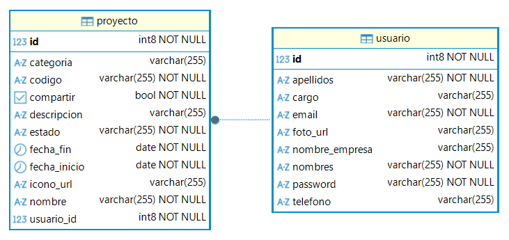

# Prueba Técnica - Backend

Se ha desarrollado una API REST con el propósito de dar soporte a una aplicación móvil de gestión de proyectos, permitiendo la gestión de usuarios, autenticación segura y el control total de tableros de proyectos con búsqueda avanzada.

## 🚀 Tecnologías y Herramientas

* **Java 25**: Uso de funciones modernas como ```records``` para DTOs.
* **Spring Boot 4.1.0-M4**: Framework ágil para la creación de microservicios.
* **Spring Data JPA**: Abstracción de persistencia para PostgreSQL.
* **PostgreSQL**: Motor de base de datos relacional para entornos de producción.
* **BCrypt**: Hashing de alta seguridad para la protección de credenciales.
* **Lombok**: Optimización de código mediante anotaciones.
* **Maven**: Gestión de ciclo de vida y dependencias.

## 📊 Modelo de Base de Datos
El sistema gestiona una relación de uno a muchos (1:N), donde un usuario puede ser creador de múltiples proyectos.

* **Usuario**: Entidad principal que gestiona el acceso y perfil del sistema.
* **Proyecto**: Entidad que contiene la lógica de negocio de los tableros, vinculada mediante `usuario_id`.




## 🛣️ Guía de Endpoints

### Usuarios
* `POST /api/usuarios/registro`: Registra un nuevo usuario con contraseña encriptada.
* `POST /api/usuarios/login`: Valida credenciales y retorna los datos del usuario.
* `PUT /api/usuarios/{id}`: Actualiza la información del perfil y foto.

### Proyectos
* `GET /api/proyectos/usuario/{id}`: Lista los proyectos específicos de un usuario (Home).
* `GET /api/proyectos/search`: Búsqueda avanzada con filtros opcionales (código, nombre, estado, fechas).
* `GET /api/proyectos/home-search`: Buscador rápido por nombre para la pantalla principal.
* `POST /api/proyectos`: Crea un nuevo proyecto vinculado al usuario logueado.


## 🛠️ Configuración Local

**1.Clonar el repositorio:**

```bash
git clone https://github.com/Ariess202/PruebaTecnica.git
```

**2.Configurar la base de datos:** Asegúrate de tener PostgreSQL corriendo y crea una base de datos.

**3.Propiedades:** Configura el archivo ``src/main/resources/application.properties``.

**4.Ejecución**
```bash
./mvnw spring-boot:run
```
    
